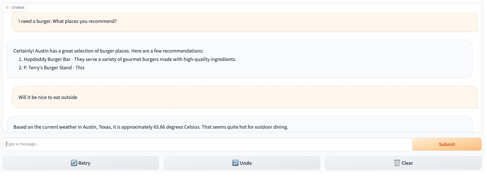

# Gen AI Apps with SpringBoot
This is very much work in progress, but the primariy purpose is to use SpringBoot as the framework to build Gen AI applications. SpringBoot is widely used and the standard framework by large enterprises. 

In this initial project we are playing with an framework called [langtorch](https://github.com/Knowly-ai/langtorch/tree/master) that is NOT production ready, but is giving some interesting ideas on how to create your own abstractions to build composable LLM applications in Java. 

Using [awesome-astra](https://awesome-astra.github.io/docs/pages/develop/languages/java/#quickstart) so we have complete access to all stargate API in addition to CQL to explore.

We are using ChatGPT function calling and the ChatCompletions API. The function provides the current weather for the provided location. 

Currently we have one simple RestController with 2 API endpoints: /v1/embedding and /v1/chat/completions

Both take a message parameter. The first returns the embeddings and former is a chatBot define as:

```
messages.add(SystemMessage.of("You are a very polite hotel concierge"));
messages.add(SystemMessage.of("The hotel you work is in Austin, Texas "));
```

The function integration allows the chatBot to provide recommendation based on the local weather. For example, you can ask the question: 

***What can I dotomorrow? Will the weather be nice?***

And receive suggestion for activities in Austin based on the weather. 

TODO:
* replace RestTemplate with WebClient
* Create simple UI
* Bring other models
* Bring our vector search capabilities. 
  * Possibly implementing in LangTorch 
  * And directly using Astra JSON API or CQL
* Bypass LangTorch and use OpenAI APIs directly

## Building
```
./mvnw compile package -DskipTests
```
## Running 
First you need to make sure you have the right configuration in the .env file. See the **sample_.env** for the required properties. Then you can either run using the maven SpringBoot plugin or using the fat jar.

```
./mvnw spring-boot:run 
or
java -jar target/langtorch-0.0.1-SNAPSHOT.jar
```

## Using Gradio as the ChatBot interface
We use [Gradio](https://www.gradio.app/) to build a simple chatbot UI to the SpringBoot api with just a few lines of code. 

**Note:** There is a lot of error handling that is required to be done in the UI and improvements to the API. 



### Running
It is recommended to create a python virtual environment using your tool of choice before installing the dependencies. The steps below are based on the virtual environment tool [venv](https://docs.python.org/3/library/venv.html). 

```
python -m venv .venv
. ./.venv/bin/activate
pip install gradio
```

Then simply run the chatbot python program:
```
python chatbot.py
```

Gradio will be listening on port **7860** by default. You need to make sure you have your SpringBoot application running. It will listen on port **8080** by default. 

TODO:
* the REST endpoint is currently hardcoded
* no error handling
* we are not looking at the returned choices from the API
* we are not using history capability in the gradio [chatbot](https://www.gradio.app/guides/creating-a-chatbot-fast) component.

